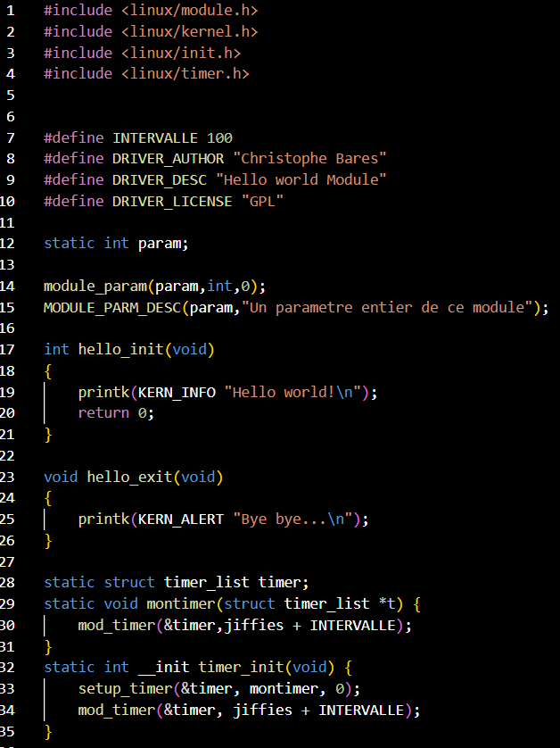

TP Linux embarqués :

1.  Prise en main :

1.1 Préparation de la carte SD

Avant de commencer l'utilisation de notre carte VEEK-MT25, nous avons du
préparer notre carte SD en la flashant. Pour cela nous avons utilisé le
logiciel Win32DiskImager. Une fois la carte SD flashé, nous avons allumé
la carte VEEK pour voir si elle s'allumait correctement et que nous
pouvions commencé à l'utiliser.

2.  Connexion au système

1.2.1 Liaison série

Pour pouvoir utiliser notre carte, nous avons du nous connecter pour
pouvoir la manipuler car il n'y a pas de clavier relié à celle-ci. Pour
commencer nous avons donc connecter notre carte et notre ordinateur sur
le même réseau wifi. Une fois ceci fait, il nous fallait son adresse IP
pour pouvoir nous connecter dessus en SSH. Pour cela nous nous sommes
connecter en liaisons série, pour cela nous avons utilisé le logiciel
putty qui nous le permettait. Une fois connecté via la liaison série,
nous avons effectué un reboot pour voir si nous avons bien le contrôle
sur la carte VEEK. La carte a donc bien redémarré. Nous avons regardé
par la suite la taille de l'image que l'on a mis sur notre carte SD.

La taille de l'image est : 1.3Go (dev/root). On a une taille de 3Go, on
utilise 1.3Go et 1.5Go sont disponibles.\
{width="4.274311023622047in"
height="1.646981627296588in"}

Grace à la commande df -h nous voyons l'espace utilisé sur la carte SD.

Avec cette commande, nous pouvons augmenter la taille du système de
fichiers pour pouvoir profiter de la taille de la carte SD en totalité :
./resize2fs_once lorsque l'on veut faire cela il faut avertir la carte
que l'on va faire ceci en lui faisant un root : ./expand_rootfs.sh. Dès
que cette commande a été effectué nous devons faire un reboot. Une fois
le reboot fait nous vérifions que notre taille a bien augmenter .

{width="4.583254593175853in"
height="2.4052985564304463in"}

Nous pouvons donc voir que la taille est bien de 32Go.

1.3 Configuration réseau :

Ensuite, nous devons vérifier si la carte veek dispose bien d'une
adresse IP, pour cela nous devons brancher la carte VEEK sur le switch
via un câble réseau, puis nous faisons ifconfig :

{width="4.652668416447944in"
height="2.6545647419072615in"}

Nous pouvons voir que celle-ci dispose bien d'une adresse IP (inet6 pour
eth0).

Ensuite, nous écrivons un code à l'aide de vim dans le fichier
/etc/network/interfaces pour pouvoir avoir l'adresse IP :

{width="4.898862642169729in"
height="1.338115704286964in"}

Après avoir reboot, nous refaisons un ifconfig pour voir notre adresse
ip :

{width="4.533266622922135in"
height="2.504489282589676in"}

Nous testons par la suite le ping via une invite de commande sur notre
machine windows :

{width="4.031523403324584in"
height="3.320496500437445in"}

Nous pouvons voir que le premier ping c'est exécuté correctement alors
que le deuxième non mais cela est normal car nous avons débrancher le
port ethernet pour voir si cela fonctionnait correctement.

Nous avons également fait un ping depuis notre terminale de machine
virtuelle vers google pour voir si celui-ci fonctionnait correctement :

{width="4.034166666666667in"
height="2.1469302274715663in"}

Nous pouvons voir que celui-ci fonctionne correctement.

Nous avons vérifié que la ligne : « PermitEmptyPasswords yes » celle-ci
était bien présente.

{width="5.548205380577428in"
height="1.6555325896762905in"}

Nous pouvons voir que le terminale nous dit que nous sommes bien
connectés.

**[1.4.1 Exploration des dossiers /sys/class et /proc :]{.underline}**

Nous avons explorer les fichiers en allant dans le repertoire
/sys/class :

{width="4.90286198600175in"
height="4.668312554680665in"}

On peut comparer avec notre machine virtuelle :

{width="6.3in"
height="0.9291666666666667in"}

Nous pouvons voir qu'il y a des différences entre les deux ce qui
signifie qu'il y a bien des entrées nouvelles.

1.4 Compilation croisée

Il existe deux méthodes pour compiler un programme sur la carte VEEK :

\- directement sur la carte à l'aide du gcc

\- sur le pc en utilisant une chaine de compilation croisée sous linux
(apt install gcc-arm-gnueabihf)

En ce qui nous concerne nous utilisons une machine virtuelle avec
laquelle nous allons avoir un dossier partagé entre notre ordinateur et
la machine virtuelle.

1.4.3 : Hello world !

Nous avons donc créé un code pour afficher « hello world ! », une fois
ceci fait nous avons essayé de le compiler.

Nous avons utilisé le cross-compilateur :

arm-linux-gnueabihf-gcc hello.c -o hello.o

{width="4.3051891951006125in"
height="1.357711067366579in"}

Après avoir compiler, nous avons essayé de l'exécuter sauf que celui-ci
ne fonctionne pas car ce n'est pas le bon format d'exécutable.

Nous avons donc envoyé le fichier exécutable sur notre carte, pour cela
nous avons utilisé la commande :

{width="6.3in" height="0.6840277777777778in"}

Nous regardons donc sur le terminale de notre carte pour regarder si nos
documents sont bien arrivés :

{width="3.359400699912511in"
height="0.8854243219597551in"}

Nous avons donc exécuter le fichier .o, nous pouvons voir que celui-ci
s'exécute bien.

Nous venons donc d'utiliser la compilation croisée, en ayant compiler le
programme sur notre VM et exécuter le fichier sur notre carte.

1.4.4 Accès au matériel :

Un certain nombre de drivers sont fournis. Comme tous les drivers sous
Linux, ils sont accessibles sous forme de fichiers. Par exemple pour
allumer l'une des LED rouge de la carte, il suffit d'écrire un '1' dans
le bon fichier.

Nous avons donc fait le test d'allumer les leds à la main :

{width="5.885693350831146in"
height="0.7791797900262467in"}

Lorsque l'on regarde sur la carte les leds demandées s'allument
correctement.

Chenillard :

{width="4.630366360454943in"
height="3.468180227471566in"}

{width="4.531187664041995in"
height="2.5363068678915135in"}

TP2 :

Nous avons dû créer un programme qui accède directement aux registres
depuis l'espace utilisateur. A cause de la virtualisation de la mémoire,
il n'est pas possible d'écrire facilement dans un registre comme on en a
l'habitude. Il faut donc remapper la mémoire pour demander à l'os de
nous fournir une adresse virtuelle.

On utilise donc la fonction mmap(), nous savons que le registre du GPIO
connecté aux LED est disponible à l'adresse : 0xFF203000 :

{width="5.491427165354331in"
height="2.837720909886264in"}

{width="4.134899387576553in"
height="0.8540594925634296in"}

Nous pouvons voir que l'adresse renvoyer n'est pas la meme, cela est dû
à la mémoire virtuelle qui peut causer ce changement de valeur.

2.2) Compilation de module noyau sur la VM :

Pour pouvoir compiler des modules sur notre VM, nous avions besoin de
différents paquets :

-   Sudo apt install linux-headers-amd64

-   Sudo apt install bc

Nous avons donc fait un make sur le fichier trouver dans les ressources
du TP2, on peut voir que notre .ko a bien été créé :

{width="6.3in" height="2.2708333333333335in"}

Nous testons donc par la suite les commandes :

{width="4.501111111111111in"
height="1.952620297462817in"}

{width="5.154315398075241in"
height="1.9033234908136483in"}

{width="3.749530839895013in"
height="0.5728455818022747in"}

{width="2.353872484689414in"
height="0.635336832895888in"}

Nous avons également ajouté au code la possibilité d'utiliser un timer.

Ensuite nous avons testé avec la création d'une entrée :

{width="4.749406167979003in"
height="0.6769991251093613in"}

Nous pouvons voir que notre entrée est bien créée.

Nous avons testé l'utilisation d'un paramètre dans un module, voici la
fonction codée :

{width="3.5946872265966756in"
height="1.3820844269466317in"}

Voici les résultats :

{width="4.577331583552056in"
height="2.694401793525809in"}

Nous remarquons que le paramètre a bien été créer car il nous est
retourné.

2.3 CrossCompilation de module noyau

À cause de la puissance limitée du processeur de la carte cible, la
compilation, en particulier la compilation de modules noyau, est
relativement longue. Nous allons donc, une fois encore, cross-compiler
les modules noyau pour la carte SoC à l'aide de la VM.

2.3.1 Préparation de la compilation

Nous avons du installer des fichiers en plus pour que la compilation
puisse se faire correctement :

\- sudo apt install bc

\- sudo apt install crossbuild-essential-armhf

\- sudo apt install binutils-multiarch

Nous avons également exécuté la commande suivante :

whereis arm-linux-gnueabihf-gcc

{width="5.21875in" height="0.34375in"}

Cela nous renvoie donc son chemin que nous utiliserons par la suite.

2.3.2 :

Nous avons récupérer un fichier sur la carte VEEK ; /proc/config.gz dans
le dossier source du noyau.

Nous avons donc récupérer le fichier que l'on souhaitait pour pouvoir le
dezipper par la suite :

{width="5.196482939632546in"
height="1.9240507436570429in"}

Une fois récupérer nous devons le dezipper :

gunzip config.gz

mv config .config

Lorsque l'on renomme le fichier en .config celui-ci n'apparait plus car
les fichiers commençant par un point ce sont des dossiers cachés. Pour
pouvoir le voir nous devons faire ls -a.

Ensuite, nous devons exécuter quelques lignes de code afin de tout bien
paramétré :

export CROSS_COMPILE=/usr/bin/arm-linux-gnueabihg-

export ARCH=arm

make prepare

make scripts

La commande export est utilisée pour garantir que les variables
d\'environnement et les fonctions seront transmises aux processus
enfants. Cela n\'affecte pas la variable d\'environnement existante.

Nous pouvons voir que la ligne export compile s'arrête avec un tiret,
cela est normal car le gcc n'est pas a ajouter il est mis
automatiquement, si nous l'ajoutons après le tiret, nous aurons des
erreurs lors de l'exécution des 2 lignes make.

2.3.3 Hello word

Nous avons donc copier dans un dossier pour faire le module hello.c :

\*{width="3.5420713035870515in"
height="4.726665573053368in"}

{width="2.383495188101487in"
height="1.2469510061242344in"}

Une fois le code récupéré et placé dans un dossier, nous avons modifier
le makefile pour que celui-ci fonctionne dans notre situation :

{width="4.7806222659667545in"
height="2.9926312335958007in"}

Nous pouvons voir le makefile sur la photo ci-dessus, avec la mise à
jour du chemin de notre noyau et l'ajout d'un flags_module. Nous pouvons
également voir la commande scp quoi nous permet de transferer un fichier
de notre machine virtuellle à la carte VEEK.

Voici le screen qui montre que notre hello word fonctionne bien sur
notre SOC.

Chenillard Yes :

On veut créer un chenillard dont on peut modifier :

--- Le pattern depuis le fichier : /proc/ensea/chenille

--- La vitesse au moment du chargement du module.

Nous avons donc créé un module qui nous permettait de pouvoir respecter
les conditions. Dans cette partie, on ne voulait pas faire clignoter les
leds de la carte VEEK mais juste faire l'affichage pour voir si cette
étape fonctionnait.

{width="2.4731452318460194in"
height="4.438241469816273in"}

{width="1.619012467191601in"
height="3.681185476815398in"}

Les leds s'allument bien comme il faut et nous pouvons régler la vitesse
d'affichage des leds avec un paramètre.

TP3 : Device tree

L'objectif de ce TP est de définir son propre périphérique, et de
programmer un module qui identifie la présence du périphérique et se
configure automatiquement en sa présence. Cet automatisme s'appuye sur
le Device Tree.

Le fichier DTS/DTB (.dts) est un fichier qui est installé à coté du
noyau sur la partition de boot, et qui lui indique quels sont les
périphériques à sa disposition. Nous voulons accéder aux LED en direct.
Or le device-tree étant déjà configuré, ces leds sont déjà utilisées par
les drivers fournis par Altera, ce qui nous empêche d'y accéder. Pour
éviter cela, 2 possibilités : --- Modifier le fichier dts existant ; ---
Recréer son propre design avec QSYS, puis ce qui va générer un nouveau
fichier dts.

Pour notre part, nous utilisons la première méthode.

Nous avons chercher le fichier soc_system.dts qui se situait dans un
dossier que nous avions télécharger précédemment. Une fois celui-ci
trouver, nous avons du le modifier :

Avant :

ledr: gpio@0x100003000 {

> compatible = \"altr,pio-16.1\", \"altr,pio-1.0\";
>
> reg =\<0x00000001 0x00003000 0x00000010\> ;
>
> clocks = \<&clk_50\>;

Après :

ledr: ensea {

> compatible = \"dev,ensea";
>
> reg =\<0x00000001 0x00003000 0x00000010\> ;
>
> clocks = \<&clk_50\>;

Nous installons par la suite le compilateru device tree sur notre VM :

sudo apt install device-tree-compiler

Puis compiler le fichier .dts en fichier .dtb qui est un fichier lisible
par le noyau :

dtc -O dtb -o soc_system.dtb soc_system.dts

Pour pouvoir acceder à la partition boot sur la carte VEEK, nous avons
monté la partition :

mkdir /root/mntboot

mount /dev/mmcblk0p1 mntboot

Nous avons remplacé le fichier existant par celui provenant de notre
machine virtuelle, puis rebooter la carte VEEK.

Nous vérifions que nous avons bien eu ce que l'on souhaitait.

Ensea bien présent dans un bridge :

{width="6.3in"
height="2.2381944444444444in"}

{width="6.3in"
height="0.9326388888888889in"}

3.1 module accedznt au LED via /dev :

Nous disposons d'un fichier gpio-leds .c La compilation de celui-ci a
bien réussi, nous avons bien tous les fichiers créer par le makefile.

{width="5.135416666666667in"
height="0.7083333333333334in"}

La fonction probe va nous servir à récupérer des données

La fonction probe : Appelé chaque fois que le noyau trouve un nouveau
périphérique que notre pilote peut gérer

Elle sert à allumer la led mais également à récupérer les données.

La fonction remove : Est appelé chaque fois qu\'un périphérique géré par
ce pilote est supprimé.

Elle sert à éteindre la led mais également à supprimer un fichier dans
/dev

La fonction read : Cette fonction est appelée chaque fois qu\'une
opération de lecture se produit sur l\'un des fichiers de caractères.
Elle sert à récupérer la valeur de la led

La fonction write : // Cette fonction est appelée chaque fois qu\'une
opération d\'écriture se produit sur l\'un des fichiers de caractères.
Elle sert à écrire une valeur de leds

3.2 Module final

Le cahier des charges est le suivant :

Réaliser un chenillard qui rempli les conditions suivantes :

--- Choix de la vitesse de balayage par une option au moment du
chargement du module

--- Récupération de la vitesse courante par lecture du fichier
/proc/ensea/speed

--- Modification de la patern par écriture dans le fichier
/dev/ensea-led

--- Récupération du patern courant par lecture du fichier /dev/ensea-led

--- Modification du sens de balayage par écriture du fichier
/proc/ensea/dir

--- Récupération du sens de balayage par lecture du fichier
/proc/ensea/dir

Nous avons commencé par mettre en place le timer puis par la suite le
paramètre :

{width="6.3in" height="0.21388888888888888in"}

Nous avons augmenté la valeur de la fréquence et celui-ci à donc bien
clignoter plus vite

On a implémenté par la suite la fonction speed read qui nous permet de
lire la valeur de speed stocker dans le fichier qui se situe dans
/proc/ensea/speed.

{width="6.3in"
height="2.8243055555555556in"}

Nous pouvons voir que dans les 2 exemples fait nous avons bien la valeur
de notre vitesse qui est écrite dans le fichier speed.

Ensuite, nous avons fait le pattern avec le sens de defilement des
leds :

{width="3.7708333333333335in"
height="1.0416666666666667in"}

Nous pouvons voir que le sens est de 1 donc les leds vont de gauche à
droite et si il s'agit d'une autre valeur cela veut dire que les leds
vont de droite à gauche.

Nous avons fait pour le changement de sens du clignotement des leds,
nous pouvons voir que nous lisons la valeur pour la changer par la
suite :

{width="4.541317804024497in"
height="1.6389720034995625in"}

Nous avons lu la valeur du pattern pour savoir si les leds défilent les
unes apres les autres ou si on clignote toutes les leds.

{width="4.789179790026247in"
height="1.03205927384077in"}

Nous pouvons voir que la valeur de notre register est de 0 ce qui
signifie que notre fichier est bien ouvert.

Nous avons testé pour modifier le pattern (si le pattern vaut 0 alors
les leds vont s'allumer les unes après les autres alors que s'il vaut 1
nous faisons clignoter les leds).

{width="3.6080621172353458in"
height="1.9620220909886263in"}
